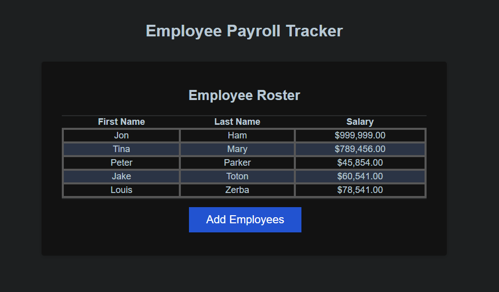

# Payroll-Incorporated

## Description

• This website was designed with employee data in mind. Our task was to complete an existing codebase by adding functionality to input employee information and display it dynamically on the website. Here I had to learn how to not only write functions to complete this task but also how to incorperate it within existing code base. This required me to use existing variable names and function names in order to ensure that the previously given functions would still function correctly. We were tasked not to adjust the previous code base when the task was completed. During testing I did however adjust and change much of the existing code. Once I had figured out how to get everything working I then went back and patched everything back up to normal and debugged as I went. Finally I was able to get everything working almost as entended. This project caused me to debug quite a lot. Luckily for me, I rather enjoy debugging code. However, I underestimated just how much I would have to do. Along the way I learned a lot and refreshed my javascript experience. I have not used javascript in these manors since college. In fact, most of the scripting I do at work is quite easy and does not require as much complexity. Here I had to learn string manipulation, array usage and iteration, object interaction and creation as well as how arrays and objects work together. I even needed to utilize functions such as .sort and .toUppercase as well as many other existing functions wihin the language to achieve my goals. This was a very informative and fun project to undertake and I enjoyed much of it as I completed it.

## Link to Deployed Application.

• [https://jtoton.github.io/Payroll-Incorporated/]

## Table of Contents:

- [Installation](#installation)
- [Usage](#usage)
- [Credits](#credits)
- [License](#license)
- [Mockup](#Mockup)
- [Badges](#Badges)
- [Features](#Features)
- [Contributions](#Contributions)
- [Tests](#Tests)
- [Citations](#Citations)
- [NewCitations](#NewCitations)

## Installation

• There are no installation steps required. The project is housed within a GitHub repository that has an index.html file within it. All assets and files are included within the folders and sub-folders located on the repo.
If one wanted to pull the repo to examine the project in detail then cloning the repository would be the only step required. Otherwise the link is live and can be accessed here on GitHub.

## Usage

• Website usage is limited to accessing the url via the index.html provided. Opening the link will show that it is a single page that has information located on the main landing page.
There is a list of information regarding a mock business that details search engine optimization, reputation management as well as social media marketing.
Additionally, more information on how lead generation, brand awareness and cost managment can assist in any business.

## Credits

• All credit for the materials, files and code are giving to the bootcamp instructors and the information provided within the course material.

• Information and details can be found here: [https://bootcampspot.instructure.com/courses/5301/assignments/74767?module_item_id=1209851].

• Additionally, the base project was cloned from this repository (README and Instructions). [https://git.bootcampcontent.com/University-of-Utah/UofU-VIRT-FSF-PT-02-2024-U-LOLC].

• Other examples or assistance was located from: [https://www.w3schools.com/html/html5_semantic_elements.asp].

• Any and all other information gathered was located via links provided in the previously cited school links which housed other resources and links to view and learn from.

## License

• This project has a standard MIT license. Source: https://choosealicense.com/licenses/mit/

• This license seemed appropriate given that it will be accessed, cloned and assessed by any and all who may be performing a review, assessment or grading of the project and my work herewithin.

## Badges

## Mockup

 - upload new picture later when deployed

## Features

• index.html file that houses the code for the project and links together all assets used within it.

• script.js to control state changes within a dropdown menu.

• mediaqueries.css to control all media screen flex adjustments for different devices.
This was something that I picked up online and greatly used to my benifit by having a
more organized structure.

• Images that are nested within the HTML and CSS to be presented on screen.

## Contributions

• Contribuation are not welcome and or accepted.

• This project is a graded assignment that will reflect my progress within the first 1 to 2 weeks of class.

• However, it will be accessed, cloned and accessed by any and all who may be performing a review, assessment or grading of the project and my work herewithin.

• That being said, any of the aforementioned representatives of the school or private company that are responsible for accessing, grading or reviewing the project have expressed permission to edit, add notes, add comments or perform any work necessary to complete this task.

## Tests

• Testing has not been included within this project as of yet. I look forward to learning more about this process, given my QA experience, and adding it to the project in the future.

## Citations

• Agile Alliance. (2023, October 18). Agile Manifesto for Software Development | Agile Alliance. Agile Alliance |. https://www.agilealliance.org/agile101/the-agile-manifesto/

• CSS Property: list-style-type | HTML Dog. (n.d.). https://www.htmldog.com/references/css/properties/list-style-type/

• GitHub: Let’s build from here. (n.d.). GitHub. https://github.com/

• OpenAI. (2023). ChatGPT (Mar 14 version) [Large Language model]. (n.d.). ChatGPT (Mar 14 Version) [Large Language Model]. https://chat.openai.com/chat

-NOTE: ChatGPT was only used to assist in creating dialog for the README file. The OpenAI software was not used to assist in any code generation, HTML edits, CSS edits or
otherwise any of the assets located within the repository other than this README specifically. The software was used to assist in creating a professional README.md file that
would meet standards within the industry (to the best of my knowledge). Additionally, school resources, linked within the citations already, were used in combination to flush
out the design.

• GitLab. (n.d.). https://git.bootcampcontent.com/University-of-Utah/UofU-VIRT-FSF-PT-02-2024-U-LOLC

• What makes up a web development project? (n.d.). The Full-Stack Blog. https://coding-boot-camp.github.io/full-stack/web-development/web-dev-project

• All other links, sources and information gained and used within the project were found or otherwise located within the above sources(sublinks within the above links). The
classwork, modules, TA's, as well as the instructor provided a multitude of links within the assignment itself as well as within class demonstrations and our communication
through slack and or discord.

• All previous resources were additionally used within this project. However more resources were used within as I attempted to create more advanced sections within the . js .css and index file for my first porfolio attempt.

• Curriculum | University of Utah Professional Education Coding Boot Camp. (2024, March 6). University of Utah Professional Education Boot Camps. https://bootcamps.continue.utah.edu/coding/curriculum/

## NewCitations

• Function return values - Learn web development | MDN. (2024, January 1). MDN Web Docs. https://developer.mozilla.org/en-US/docs/Learn/JavaScript/Building_blocks/Return_values

• How to create a prompt for an array in JavaScript. (n.d.). https://www.shecodes.io/athena/45475-how-to-create-a-prompt-for-an-array-in-javascript#google_vignette

• JavaScript Array reference. (n.d.). https://www.w3schools.com/jsref/jsref_obj_array.asp

• JavaScript Array sort() Method. (n.d.). https://www.w3schools.com/jsref/jsref_sort.asp

• JavaScript arrays. (n.d.). https://www.w3schools.com/js/js_arrays.asp

• JavaScript string Methods. (n.d.). https://www.w3schools.com/js/js_string_methods.asp

• JavaScript String slice() Method. (n.d.). https://www.w3schools.com/jsref/jsref_slice_string.asp#:~:text=The%20slice()%20method%20extracts,second%20is%201%2C%20.
• Pierce, D. (2022, November 28). 

• How to resolve an uncaught reference error in Javascript | Rollbar. Rollbar. https://rollbar.com/blog/javascript-referenceerror/#:~:text=Reference%20errors%20in%20Javascript%20are%20mainly%20thrown%20when%20an%20attempt,called%20in%20the%20correct%20scope.

• return - JavaScript | MDN. (2023, August 11). MDN Web Docs. https://developer.mozilla.org/en-US/docs/Web/JavaScript/Reference/Statements/return

• GfG. (2023, December 7). Check if a variable is a string using JavaScript. GeeksforGeeks. https://www.geeksforgeeks.org/check-if-a-variable-is-a-string-using-javascript/ 

• ISNAN() - JavaScript | MDN. (2023, December 29). MDN Web Docs. https://developer.mozilla.org/en-US/docs/Web/JavaScript/Reference/Global_Objects/isNaN 

• return - JavaScript | MDN. (2023, August 11). MDN Web Docs. https://developer.mozilla.org/en-US/docs/Web/JavaScript/Reference/Statements/return 

• while - JavaScript | MDN. (2023, September 10). MDN Web Docs. https://developer.mozilla.org/en-US/docs/Web/JavaScript/Reference/Statements/while
